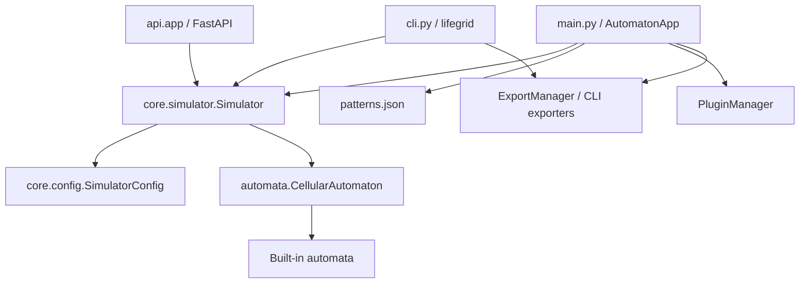

# LifeGrid Technical Reference

This document is the implementation-oriented reference for LifeGrid 3.2.1. It
describes the runtime architecture, public Python contracts, command-line and
HTTP interfaces, data formats, extension points, packaging model, and the
operational boundaries of the current implementation.

The project is a Python application with three primary consumers:

1. The Tkinter desktop application.
2. The headless `lifegrid` command and `src/cli.py` module.
3. The FastAPI application exposed by `src/api/app.py`.

The same simulation concepts are shared by all three, but not every feature is
available through every entry point. The tables and examples below call out
those differences explicitly.

Version 4 public imports use the `lifegrid.*` namespace:

```python
from lifegrid.core.simulator import Simulator
from lifegrid.core.config import SimulatorConfig
from lifegrid.automata import ConwayGameOfLife
from lifegrid.io import RLEParser, ExportManager
from lifegrid.plugins import PluginManager
```

The current implementation retains its internal module locations during the
3.2.1-to-4 migration, but these facade imports are the stable namespace for
new code. Optional subsystems are loaded only when their dependencies are
available; importing `lifegrid` for the core engine does not require the GUI or
API extras.

The current engine also persists raw automaton state separately from renderer
overlays. This matters for stateful modes such as Langton's Ant, whose visible
ant marker is not part of the stored cell grid.

## 1. Supported Environment

LifeGrid requires Python 3.11 or newer. The core numerical engine uses NumPy
and SciPy. Pillow is required by the image exporters and image-related GUI
features; ImageIO and ImageIO-FFmpeg are required for video export. FastAPI
and Uvicorn provide the service layer.

The repository includes a `src` layout, but its internal modules use the
directory as a top-level import root (`from core...`, `from automata...`). The
supported source-tree invocation therefore sets `PYTHONPATH=src`, as
`run.sh` does. An editable or wheel installation handles this through the
package metadata.

```bash
# Source-tree headless invocation
PYTHONPATH=src .venv/bin/python -m cli --mode conway --steps 100

# Installed console commands
.venv/bin/lifegrid --mode conway --steps 100
.venv/bin/lifegrid-gui
```

Tkinter is required only for the GUI. A headless machine can use the CLI,
Python API, or HTTP API without opening a Tk window.

## 2. Installation and Entry Points

### 2.1 Repository launcher

```bash
./run.sh
```

The launcher:

1. Resolves the repository root relative to the script.
2. Makes `install.sh` executable when necessary.
3. Runs the installer.
4. Exports `PYTHONPATH=<root>/src`.
5. Starts `src.main` using `.venv/bin/python`.

`install.sh` checks Python and Tk availability, validates the requirements
file, creates or repairs `.venv`, and installs `requirements.txt`. An existing
directory is repaired when its Python executable or activation script is
missing.

### 2.2 Console commands

| Command | Implementation | Purpose |
|---|---|---|
| `lifegrid` | `cli:main` | Headless simulation and export |
| `lifegrid-gui` | `main:main` | Tkinter desktop application |

The GUI can also be launched from the source tree:

```bash
PYTHONPATH=src .venv/bin/python -m src.main
```

The `lifegrid` command returns `0` for a successful simulation and `1` for
initialization or export failures. `argparse` returns its normal non-zero
status for invalid command-line values.

### 2.3 Package contents

Setuptools discovers Python packages below `src/`, installs the top-level
modules listed in `pyproject.toml`, and includes `src/data/patterns.json` as
package data. The pattern data is intentionally shipped with both wheels and
source distributions.

## 3. Runtime Architecture



### 3.1 Layer responsibilities

| Layer | Location | Responsibility |
|---|---|---|
| Entry points | `src/main.py`, `src/cli.py`, `src/api/` | Adapt user input to the engine |
| Core | `src/core/` | Configuration, stepping, history, boundary helpers |
| Automata | `src/automata/` | State transitions and grid semantics |
| GUI | `src/gui/` | Tk widgets, rendering, tools, interaction state |
| Advanced | `src/advanced/` | RLE, analysis, statistics, pattern management |
| Performance | `src/performance/` | Optional GPU backend and benchmarks |
| Integration | `src/export_manager.py`, `src/plugin_system.py` | Output and runtime extension |

### 3.2 Simulation lifecycle

The normal lifecycle is:

```python
from core.config import SimulatorConfig
from core.simulator import Simulator

config = SimulatorConfig(width=128, height=96)
simulator = Simulator(config)
simulator.initialize(pattern="Glider")
metrics = simulator.step(num_steps=10)
grid = simulator.get_grid()
```

`initialize()` creates the automaton and resets generation, metrics, and undo
history. `step()` saves the pre-step grid, advances the automaton, increments
the generation, records metrics, and invokes the optional callback. The grid
shape is always `(height, width)`; coordinates exposed as `x, y` are indexed
as `grid[y, x]`.

## 4. Core Python API

### 4.1 `SimulatorConfig`

Defined in `core.config`:

```python
@dataclass
class SimulatorConfig:
    width: int = 100
    height: int = 100
    speed: int = 50
    cell_size: int = 8
    show_grid: bool = True
    automaton_mode: str = "Conway's Game of Life"
    birth_rule: set[int] | None = None
    survival_rule: set[int] | None = None
    enable_metrics: bool = True
    enable_cycle_detection: bool = True
    enable_complexity_tracking: bool = True
```

`from_dict()` ignores unknown keys. `to_dict()` returns a JSON-friendly
mapping except that rule sets remain Python sets; callers serializing the
result should convert them to sorted lists or strings first.

Core configuration validates positive dimensions and cycle-history limits and
normalizes string boundary values. Frontends additionally validate user input
before constructing it. The CLI validates positive dimensions, FPS, cell size,
and snapshot intervals, and permits zero steps.

### 4.2 `Simulator`

| Method | Return | Behavior |
|---|---|---|
| `initialize(mode=None, pattern=None)` | `None` | Creates the selected automaton and optionally loads a pattern |
| `step(num_steps=1)` | `list[dict]` | Advances one or more generations and records metrics |
| `reset()` | `None` | Clears the current automaton and metrics |
| `load_pattern(pattern_name)` | `None` | Loads a pattern and resets history |
| `replace_grid(grid)` | `None` | Replaces raw state and resets history |
| `set_cell(x, y, value=1)` | `None` | Mutates a valid cell; out-of-bounds coordinates are ignored |
| `get_grid()` | `numpy.ndarray` | Returns the current automaton grid |
| `get_raw_grid()` | `numpy.ndarray` | Returns state without renderer overlays |
| `estimate_memory_bytes()` | `int` | Estimates active grid and undo-history memory |
| `undo()` | `bool` | Restores the previous step, if available |
| `redo()` | `bool` | Reapplies an undone step, if available |
| `set_on_step_callback(callback)` | `None` | Sets a callback receiving each metric dictionary |
| `get_metrics_summary()` | `dict` | Returns aggregate metrics and history availability |

Calling `step()`, `get_grid()`, `set_cell()`, `undo()`, or `redo()` before
`initialize()` raises `RuntimeError` or returns `False`, depending on the
method. A valid `set_cell()` edit starts a new history branch and clears the
generation, metrics, undo, redo, and cycle-detection state. `step()` accepts
positive step counts in normal use; a zero count returns an empty list.

Each metric dictionary has this shape:

```json
{
  "generation": 1,
  "population": 42,
  "density": 0.0042,
  "births": 12,
  "deaths": 8,
  "state_counts": {"0": 9958, "1": 42}
}
```

`density` is `population / (width * height)`. Multi-state automata count every
non-zero cell as population, not the sum of state values. `births` and
`deaths` count transitions between zero and non-zero states; transitions
between two non-zero states are neither births nor deaths. `state_counts`
contains counts for each state reported by the automaton.

The pure helper `core.metrics.calculate_transition_metrics()` is the shared
calculation boundary for engine and adapter code. It rejects mismatched or
non-2D grids before computing metrics.

When `enable_cycle_detection` is true, the simulator stores byte-level grid
states, bounded by `max_cycle_states`, and reports the first repeated state in
`get_metrics_summary()`:

```json
{
  "cycle_detected": true,
  "cycle_start": 0,
  "cycle_period": 1
}
```

Detection is exact for retained grid fingerprints, starts after initialization,
and is reset by direct edits, reset, undo, and redo. Disable it for very large
or very long-running simulations when the additional state-history memory is
not appropriate.

### 4.3 Undo and redo semantics

The simulator pushes a copy of the grid immediately before every step. The
default history limit is 100 states. Undo decrements the generation and redo
increments it, but metrics are not reconstructed from history. A direct
`set_cell()` mutation is not automatically added to the simulator's undo
stack; GUI tools may manage their own editing history.

### 4.4 Boundary helpers

`core.boundary.BoundaryMode` provides:

| Value | Meaning |
|---|---|
| `wrap` | Toroidal edges; the default in most automata |
| `fixed` | Values outside the grid are dead/zero |
| `reflect` | Edge values are mirrored |

```python
from core.boundary import BoundaryMode, convolve_with_boundary

neighbors = convolve_with_boundary(
    grid,
    kernel,
    boundary=BoundaryMode.FIXED,
)
```

The helpers are reusable building blocks. The built-in automata do not all
accept a boundary argument; several use toroidal behavior directly.

## 5. Automaton Contract and Built-ins

### 5.1 Base contract

Every automaton derives from `automata.base.CellularAutomaton` and must
implement:

```python
class CellularAutomaton(ABC):
    def reset(self) -> None: ...
    def step(self) -> None: ...
    def get_grid(self) -> numpy.ndarray: ...
    def handle_click(self, x: int, y: int) -> None: ...
    def set_cell(self, x: int, y: int, value: int = 1) -> None: ...
    def load_pattern(self, pattern_name: str) -> None: ...
    def get_state_count(self) -> int: ...
```

The base constructor creates a zero-filled integer array of shape
`(height, width)` and calls `reset()`. Implementations may use state values
greater than one for colored or transitional cells.

### 5.2 Built-in modes

| Display name | Class | State model | Rule or behavior |
|---|---|---|---|
| Conway's Game of Life | `ConwayGameOfLife` | Binary | B3/S23 |
| HighLife | `HighLife` | Binary | B36/S23 |
| Immigration Game | `ImmigrationGame` | Colored | Conway competition between colors |
| Rainbow Game | `RainbowGame` | Multi-state | Color-producing Life variant |
| Langton's Ant | `LangtonsAnt` | Grid plus ant state | Ant movement and turning |
| Wireworld | `Wireworld` | Four state | Empty, conductor, head, tail |
| Brian's Brain | `BriansBrain` | Three state | Dead, firing, refractory |
| Generations | `GenerationsAutomaton` | Multi-state | Fading generations |
| Hexagonal Life | `HexagonalGameOfLife` | Binary | Six-neighbor B2/S34 on an odd-r layout |
| Custom Rules | `LifeLikeAutomaton` | Binary | User-supplied B/S sets |

The core simulator registers all of these modes, including `Hexagonal Life`.
`Custom Rules` is selected when both `birth_rule` and `survival_rule` are
provided or when the CLI receives `--rule`.

### 5.3 Life-like rules

```python
from automata.lifelike import LifeLikeAutomaton, parse_bs

birth, survival = parse_bs("B36/S23")
automaton = LifeLikeAutomaton(100, 100, birth, survival)
automaton.step()
```

`parse_bs()` returns two sets of digit values. It is intentionally tolerant of
spacing and case, but callers should still reject malformed rules in user
interfaces. The current implementation supports neighbor counts represented
by single digits, which is sufficient for the standard eight-neighbor
Life-like notation.

## 6. Patterns and RLE

### 6.1 Bundled pattern data

`src/data/patterns.json` stores pattern categories, names, coordinate lists,
and descriptions. Coordinates are offsets from the grid center when loaded by
the Conway automaton.

Example:

```json
{
  "Conway's Game of Life": {
    "Glider": {
      "points": [[1, 0], [2, 1], [0, 2], [1, 2], [2, 2]],
      "description": "A small spaceship that travels diagonally."
    }
  }
}
```

`patterns.PATTERN_DATA` merges JSON-backed Conway patterns with procedural
and built-in entries for the other modes. `Random Soup` is generated at load
time and is not deterministic unless NumPy's random generator is seeded by the
caller.

### 6.2 RLE parser and encoder

```python
from advanced.rle_format import RLEEncoder, RLEParser

grid, metadata = RLEParser.parse(
    "x = 3, y = 3, rule = B3/S23\nbo$2bo$3o!"
)
rle = RLEEncoder.encode(grid, rule="B3/S23", comments=["example"])
```

Supported RLE tokens are `b`, `o`, `$`, `!`, and numeric run lengths. Header
metadata includes `x`, `y`, and optional `rule`; comment lines are returned as
`metadata["comments"]`. The parser clips decoded rows and cells to declared
dimensions and uses a minimal 1x1 grid when no dimensions or pattern content
are available.

## 7. Command-Line Reference

```text
lifegrid [OPTIONS]
```

| Option | Default | Description |
|---|---:|---|
| `--mode`, `-m` | `conway` | Mode name or alias |
| `--rule` | none | Custom B/S rule; overrides mode |
| `--width`, `-W` | `100` | Positive grid width |
| `--height`, `-H` | `100` | Positive grid height |
| `--steps`, `-n` | `100` | Non-negative generation count |
| `--pattern`, `-p` | `Random Soup` | Pattern name passed to the automaton |
| `--boundary` | `wrap` | Boundary mode: `wrap`, `fixed`, or `reflect` |
| `--seed` | none | Non-negative NumPy seed for reproducible procedural patterns |
| `--export`, `-o` | none | Output path selected by extension |
| `--snapshot` | none | Save a versioned replayable simulator snapshot |
| `--load-snapshot` | none | Resume from a versioned simulator snapshot |
| `--fps` | `10` | Positive FPS for video/GIF timing |
| `--cell-size` | `4` | Positive output cell scale |
| `--snapshot-every` | `1` | Positive frame sampling interval |
| `--quiet`, `-q` | false | Suppress progress output |
| `--diagnostics` | false | Print environment, dependency, GPU, plugin, and resource diagnostics |
| `--stop-on-cycle` | false | Stop early when cycle detection reports a repeated state |
| `--max-cycle-states` | `10000` | Maximum cycle fingerprints retained in memory |
| `--list-modes` | false | List canonical modes and aliases, then exit |
| `--list-patterns` | false | List patterns for the selected mode, then exit |

Mode aliases include `conway`, `highlife`, `immigration`, `rainbow`,
`wireworld`, `briansbrain`, `ant`, `generations`, and `hexagonal`.

Examples:

```bash
# Run a named Conway pattern
lifegrid --mode conway --pattern Glider --steps 120

# Run a custom rule
lifegrid --rule B36/S23 --width 256 --height 256 --steps 2000 --quiet

# Reproduce a random soup exactly
lifegrid --mode conway --seed 1234 --steps 500 --export output/repeatable.json

# Inspect the installation before running a batch job
lifegrid --diagnostics

# Save a complete replayable run
lifegrid --seed 1234 --steps 500 --snapshot output/run.lifegrid.json

# Resume that run for another 500 generations
lifegrid --load-snapshot output/run.lifegrid.json --steps 500 \
  --snapshot output/run-continued.lifegrid.json

# Stop an oscillator or still life as soon as it repeats
lifegrid --mode conway --pattern Block --steps 1000 --stop-on-cycle \
  --export output/cycle.json

# Export final state and per-step statistics
lifegrid --steps 500 --export output/state.json
lifegrid --steps 500 --export output/stats.csv --quiet

# Capture sampled frames for an animation
lifegrid --mode highlife --steps 1000 \
  --snapshot-every 10 --export output/highlife.gif --fps 20
```

CLI image exporters create a simple black-and-white representation. The
`ExportManager` Python API supports richer state colors and themes.

### Export formats

| Extension | Contents |
|---|---|
| `.png` | Final grid snapshot |
| `.gif` | Sampled simulation frames |
| `.mp4`, `.webm` | Sampled video frames |
| `.csv` | Generation, population, and density rows |
| `.json` | Final grid, dimensions, run metadata, state counts, and metrics summary |

Versioned snapshots contain configuration, grid, generation, metrics, RNG
state, and automaton-specific internal state such as Langton's Ant position
and direction. `AutoSaveManager.save_simulator()` and
`AutoSaveManager.load_latest_simulator()` use the same schema, so autosave
recovery preserves engine state rather than only display settings.

The CLI creates missing parent directories for export and snapshot paths.

## 8. Export Manager API

`ExportManager` requires Pillow at construction time and stores animation
frames as NumPy copies.

```python
from export_manager import ExportManager

exporter = ExportManager(theme="dark")
exporter.add_frame(grid)
exporter.add_frame(next_grid)
exporter.export_gif("animation.gif", cell_size=6, duration=80)
exporter.export_json("state.json", grid, metadata={"generation": 42})
```

Available methods include `export_png`, `export_gif`, `export_video`,
`export_json`, `create_age_heatmap`, `get_supported_formats`, and
`is_format_supported`. Export methods return `True` on success and `False` on
recoverable file or dependency errors. Video export additionally requires
ImageIO and a working FFmpeg codec backend.

## 9. REST API

Start the service from an installed environment with:

```bash
uvicorn api.app:app --host 127.0.0.1 --port 8000
```

The interactive OpenAPI documents are available at `/docs` and `/redoc`.

Versioned REST routes are available under `/api/v1`. The current unprefixed
routes remain as migration aliases and delegate to the same handlers.
The simulation stream and collaboration WebSockets are versioned under the
same prefix.

### 9.1 Session creation

`POST /session` accepts:

```json
{
  "width": 64,
  "height": 64,
  "mode": "Conway's Game of Life",
  "birth_rule": "36",
  "survival_rule": "23",
  "pattern": "Glider"
}
```

`width` and `height` are constrained to 4 through 2048. Rule fields are
strings of digits; the service converts their digits to integer sets. When
both rules are supplied, the simulator uses `LifeLikeAutomaton` regardless of
the named mode. The response is:

```json
{"session_id": "uuid"}
```

### 9.2 Session endpoints

| Method | Path | Behavior |
|---|---|---|
| `GET` | `/health` | Returns `{"status": "ok"}` |
| `GET` | `/diagnostics` | Returns runtime, resource, and capacity diagnostics |
| `GET` | `/modes` | Lists canonical modes, descriptions, and aliases |
| `GET` | `/patterns` | Lists pattern names and descriptions for a mode |
| `POST` | `/session` | Creates an initialized session |
| `GET` | `/sessions` | Lists active sessions and metadata |
| `GET` | `/session/{id}` | Returns one session's metadata and metrics |
| `POST` | `/session/restore` | Creates a session from a snapshot |
| `DELETE` | `/session/{id}` | Deletes an in-memory session |
| `POST` | `/session/{id}/step` | Advances 1–1000 steps |
| `POST` | `/session/{id}/reset` | Resets the session to an empty state |
| `GET` | `/session/{id}/state` | Returns generation and full grid |
| `GET` | `/session/{id}/metrics` | Returns aggregate metrics and cycle status |
| `GET` | `/session/{id}/snapshot` | Returns a versioned replayable snapshot |
| `POST` | `/session/{id}/pattern` | Applies RLE or a named pattern |

Unknown IDs return HTTP 404. Invalid RLE returns HTTP 400. The current
service stores sessions in a process-local dictionary; sessions disappear on
restart. `DELETE /session/{id}` removes a session immediately and returns
`{"status": "deleted"}`.
The `LIFEGRID_MAX_SESSIONS` environment variable bounds active sessions and
defaults to 100.

### 9.3 Streaming endpoint

`WS /session/{id}/stream` accepts a session, advances it continuously, and
sends state payloads approximately every 50 ms. Each payload includes
`generation`, `width`, `height`, and a JSON-compatible `grid`.

### 9.4 Collaborative endpoint

`WS /collab/{id}?width=64&height=64` creates or joins a process-local shared
Conway session. Client messages have an `action` field:

```json
{"action": "draw", "x": 10, "y": 15, "value": 1}
{"action": "step"}
{"action": "clear"}
{"action": "start"}
{"action": "stop"}
{"action": "set_speed", "speed": 0.05}
```

The server broadcasts the complete state after each mutation. Coordinates are
validated against the current grid. Collaboration currently uses Conway
rules, not the mode selected by ordinary REST sessions.

## 10. Plugin Development

Plugins are Python files in `plugins/`. `PluginManager` imports each non-
underscore `.py` file, finds concrete subclasses of `AutomatonPlugin`,
instantiates them, and registers them by `plugin.name`.

The CLI and API load plugins from the current project's `plugins/` directory
at startup, making plugin modes available through normal mode selection and
`/modes` discovery.

Each plugin descriptor reports `source="plugin"`, its integer `api_version`,
and a capabilities mapping through the mode registry. Plugins should expose
`api_version` and may provide capability metadata for patterns, boundaries, and
multi-state behavior.

```python
from automata import CellularAutomaton
from plugin_system import AutomatonPlugin
import numpy as np


class ExampleAutomaton(CellularAutomaton):
    def reset(self) -> None:
        self.grid = np.zeros((self.height, self.width), dtype=int)

    def step(self) -> None:
        self.grid = np.roll(self.grid, 1, axis=1)

    def get_grid(self) -> np.ndarray:
        return self.grid

    def handle_click(self, x: int, y: int) -> None:
        if 0 <= x < self.width and 0 <= y < self.height:
            self.grid[y, x] = 1 - self.grid[y, x]


class ExamplePlugin(AutomatonPlugin):
    @property
    def name(self) -> str:
        return "Example"

    @property
    def description(self) -> str:
        return "A demonstration plugin"

    @property
    def version(self) -> str:
        return "1.0"

    def create_automaton(self, width: int, height: int) -> CellularAutomaton:
        return ExampleAutomaton(width, height)
```

Test a plugin without launching the GUI:

```python
from plugin_system import PluginManager

manager = PluginManager()
assert manager.load_plugins_from_directory("plugins") >= 1
automaton = manager.create_automaton("Day & Night", 32, 32)
assert automaton is not None
```

Plugin loading is intentionally isolated: an import or constructor failure is
skipped rather than terminating application startup. Plugins are not
currently sandboxed, so only load code from trusted directories.
Registration validates required metadata and rejects duplicate plugin names or
aliases that collide with existing modes. Invalid plugins are skipped during
directory discovery without replacing a working mode.

## 11. GPU Backend

`performance.gpu` exposes `xp`, `is_gpu_available`, `to_numpy`, `to_device`,
and `GPUSimulator`. CuPy is optional. If CuPy is absent or CUDA initialization
fails, `xp` is NumPy and the same API runs on the CPU.

```python
from performance.gpu import GPUSimulator, is_gpu_available

gpu_sim = GPUSimulator(grid, birth={3}, survival={2, 3})
gpu_sim.step()
host_grid = gpu_sim.get_grid()
print(is_gpu_available(), host_grid.shape)
```

`GPUSimulator` implements binary Life-like rules with toroidal boundaries. It
is a separate optimized helper; the general `core.Simulator` does not switch
its built-in automata to GPU execution automatically.

## 12. GUI Subsystems

The GUI is coordinated by `gui.app.AutomatonApp`. Supporting modules are
organized as follows:

| Module | Role |
|---|---|
| `gui.ui` | Widget construction and callback wiring |
| `gui.state` | Mutable GUI simulation state |
| `gui.rendering` | Grid, cell, symmetry, and overlay rendering |
| `gui.tools` | Pencil, eraser, stamp, and selection interactions |
| `gui.config` | Mode factories, patterns, dimensions, colors |
| `gui.new_features` | Timeline, graph, breakpoints, explorer, palette, search |
| `gui.enhanced_rendering` | Optional richer display helpers |
| `gui.ui_polish` | Visual refinements and styling |
| `ui_enhancements.py` | Theme manager and theme colors |

Tkinter callbacks must remain on the GUI thread. Long simulations, video
encoding, and expensive analytics should not block the event loop; use a
worker or batch process when integrating new operations.

The persisted `settings.json` file stores GUI preferences such as dimensions,
theme, speed, selected mode, and export directories. It is application state,
not a schema-stable interchange format; unknown keys are ignored by the
configuration loader.

## 13. Testing and Quality Gates

Run the test suite with:

```bash
.venv/bin/python -m pytest -q
```

The minimum regression surface should include:

- One initialization and one step for every built-in mode.
- Custom B/S parsing and execution.
- Pattern loading and missing-pattern behavior.
- Undo/redo state equality and generation counters.
- CLI argument validation and every export extension.
- RLE parse/encode round trips.
- API session creation, stepping, state retrieval, and invalid IDs.
- Plugin discovery and factory creation.

For a syntax-only check:

```bash
.venv/bin/python -m py_compile src/cli.py src/core/simulator.py
```

For a package check:

```bash
.venv/bin/python -m pip wheel --no-deps --no-build-isolation --wheel-dir /tmp/lifegrid-wheel .
```

Inspect the wheel to ensure `data/patterns.json` is present.

## 14. Performance and Scaling

Memory use is dominated by the grid and history snapshots. A binary grid of
shape `(H, W)` uses approximately `H * W * itemsize` bytes; the simulator can
hold up to 100 additional copied grids in the undo manager. API responses are
full nested JSON grids, so large grids can become expensive in both memory and
network bandwidth.

For large runs:

- Use `--quiet` to reduce console overhead.
- Increase `--snapshot-every` for animations.
- Avoid retaining unnecessary frames in Python lists.
- Use the GPU helper only for compatible binary Life-like workloads.
- Prefer CSV or summary metrics when a full final grid is unnecessary.
- Bound API session sizes using the existing 2048 dimension limits.

## 15. Security and Operational Notes

The API currently enables permissive CORS (`*`) and stores sessions in memory.
Run it behind an authenticated reverse proxy for non-local use. Do not expose
the development server directly to an untrusted network.

Plugin files execute with the permissions of the LifeGrid process. Treat them
as trusted code. Export paths are supplied by the caller; applications that
accept paths from users should constrain them to an approved output directory.

## 16. Extension Checklist

When adding a new built-in automaton:

1. Implement `CellularAutomaton` in `src/automata/`.
2. Export it from `src/automata/__init__.py`.
3. Register it in `core.simulator.Simulator._automaton_factories`.
4. Add the display name and factory to `gui/config.py`.
5. Add mode aliases and CLI documentation when appropriate.
6. Define valid patterns and state colors.
7. Add one smoke test and one rule-specific behavior test.
8. Update the README feature table and this reference.

When adding a new export format:

1. Add the implementation to `ExportManager` and, if needed, `src/cli.py`.
2. Validate dependencies and return behavior consistently.
3. Create parent-directory and codec failure tests.
4. Update CLI help, `docs/cli_reference.md`, and examples.

When adding a plugin-facing contract, prefer a small abstract interface and
document grid shape, state values, coordinate ordering, reset behavior, and
threading assumptions explicitly.

## 17. Known Boundaries

The following are important implementation facts rather than configuration
options:

- Core built-in automata generally use toroidal boundaries directly; the
  boundary helper is not globally injected into every automaton.
- The ordinary REST session registry has no persistence or deletion endpoint.
- The collaboration endpoint runs Conway steps inline.
- The GPU helper is opt-in and does not replace the normal simulator backend.
- The CLI's PNG/GIF/video rendering is simpler than the GUI's themed export
  path.
- Custom rule notation currently uses single-digit neighbor counts.
- Runtime pattern names are delegated to each automaton; a name unknown to an
  automaton may result in an empty grid rather than a CLI error.

These boundaries are useful targets for future enhancements and should be
considered when building automation or a service around LifeGrid.